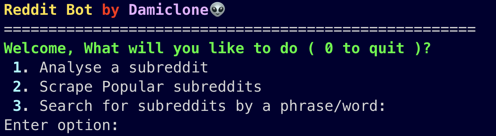
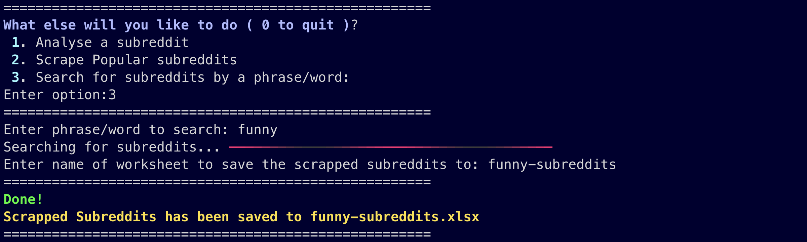

# Reddit Bot Scraper

[](https://opensource.org/licenses/MIT)
[](https://www.python.org/downloads/)

## Overview

Reddit Bot  is a Python-based bot that allows you to scrape information from Reddit using the Reddit API. This bot can be used to gather data, perform sentiment analysis, or automate various tasks on the platform.


## Features

- Scrape popular subreddits.
- Scrape subreddits by keyword.
- Analysis on a subreddit.
- Scrape posts and comments from any subreddit. (next update)
- Save scraped data to an Excel file. (Support for CSV and JSON coming soon)
- Easy-to-use and well-documented code.
- Support for Python 3.9 or higher.


## Images
* Luxury of Selecting difference options


* Analysis on a subreddit


* Scraping popular subreddit


* Scraping subreddit by keyword


* Enjoy!


## Prerequisites

- Python 3.9 or higher
- PRAW (Python Reddit API Wrapper)
- Openpyxl
- Rich

## Installation

Clone the repository (bash) :
```
git clone https://github.com/mandatedisrael/Reddit-scrapper.git


cd reddit-scraper

```

Install the required dependencies:

```
pip3 install -r requirements.txt
```

## Configuration
Before using the bot, you need to set up a Reddit script app to obtain API credentials. Follow the steps below:

1. Go to https://www.reddit.com/prefs/apps
2. Scroll down to the "Developed Applications" section and click "Create App or Another App."
3. Select "Script" as the app type.
4. After creating the app, you'll get the `client_id` and `client_secret`.
5. These credentials will be used to authenticate the bot.

## Usage
To run the Reddit bot scraper, simply execute the main script:

```
python3 main.py
```

## Contributing
Contributions are welcome! If you encounter any issues or have suggestions, feel free to open an issue or submit a pull request, Love y'all😎.